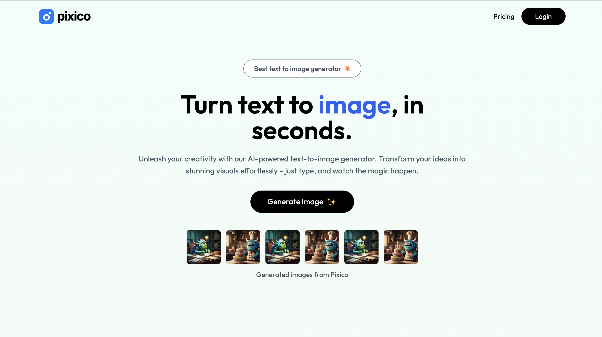
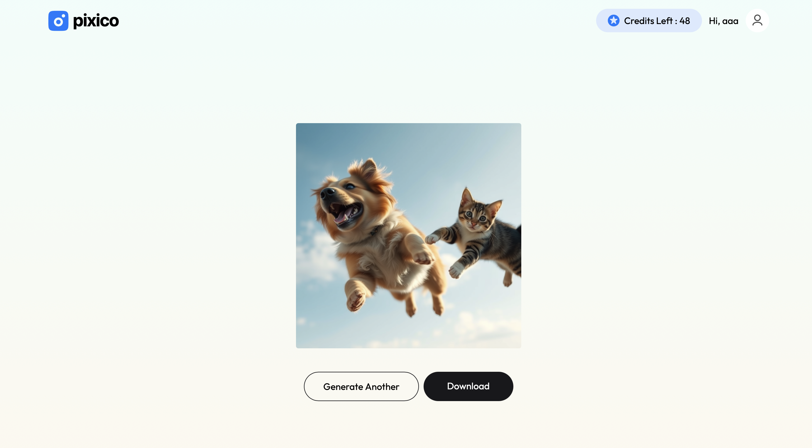

# Pixico

Pixico is an AI-powered text-to-image web application that allows users to generate images from text prompts.

## 🚀 Live Demo

https://pixico-sigma.vercel.app/

## ✨ Features

* Generate AI images from text prompts
* User authentication
* Credit-based image generation
* Secure backend API
* Online credit purchase
* Responsive web interface

## 🛠️ Tech Stack

### Frontend

* React
* Vite
* Tailwind CSS
* React Router
* Axios
* Motion

### Backend

* Node.js
* Express.js
* MongoDB
* Mongoose
* JWT Authentication
* Razorpay

### AI API

* ClipDrop Text-to-Image API

## 📁 Project Structure

```text
Pixico/
├── client/     # React frontend
└── server/     # Node.js/Express backend
```


## 👨‍💻 Author

Ankit Shah
B.Tech Computer Engineering Student


## 📸 Screenshots

### Home / Image Generation


### Generated Image

